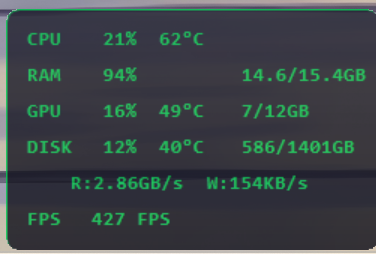
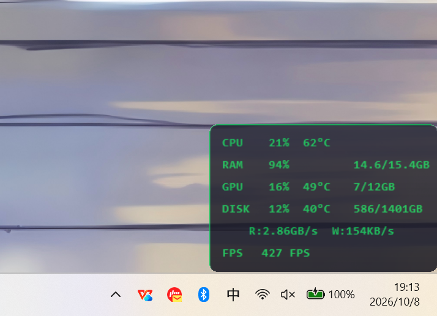

# 硬件监控浮窗（Hardware Monitor）

> 🖥️ 一个常驻桌面的**半透明悬浮窗**，实时显示 CPU / 内存 / 显卡 / 硬盘 / 游戏帧率
>
> 免安装 · 单文件 exe · 原生 WinForms · 仅占用 < 1% CPU



> 实测：CPU **21% / 62°C** ｜ RAM **94%**（14.6/15.4 GB）｜ GPU **16% / 49°C**（显存 7/12 GB）｜
> 硬盘 **12% / 40°C**（586/1401 GB，读写 2.86 GB/s）｜ 游戏帧率 **427 FPS**

<details>
<summary>看它在桌面上的样子（原图）</summary>



</details>

## 功能

| 行 | 显示内容 |
|---|---|
| **CPU** | 使用率 % + 温度 °C |
| **RAM** | 使用率 % + 已用 / 总容量（GB） |
| **GPU** | 使用率 % + 温度 °C + 显存已用 / 总量（GB） |
| **DISK** | 总容量占用 % + 实时读写速度 + 硬盘温度 |
| **FPS** | 当前前台程序的帧率（由 PresentMon 采集，全屏游戏才有效） |

**交互**

- 左键拖动移动位置，靠近屏幕边缘自动吸附
- 右键菜单：**锁定 / 解锁**（锁定后鼠标穿透，打游戏不挡操作）
- 右键 → 退出

## 环境要求

| 要求 | 说明 |
|---|---|
| Windows 10 64 位 / Windows 11 | 需要 .NET Framework 4.8 —— **Win10 1903+ 与 Win11 已内置**，不用另外安装 ✓ |
| 管理员权限 | 读取传感器与 ETW 帧率需要，**每次启动会弹一次 UAC**（见下方「已知限制」） |
| HWiNFO | 温度数据来自 HWiNFO 的共享内存。**本仓库不附带 HWiNFO**（第三方软件不允许再分发）。<br>💡 **程序会帮你搞定**：启动时若没找到 HWiNFO，会**先尝试自动下载**；如果被网络挡住，会弹窗引导你 → `【是】打开官网下载页` → 下载完选中那个 zip → 程序**自动解压装好**并写好共享内存配置，全程不用手动解压 |
| PresentMon（可选） | 帧率显示需要它。它是 Intel 的开源工具（MIT 许可），可自行从 [PresentMon 仓库](https://github.com/GameTechDev/PresentMon) 获取，放到程序目录下；**Releases 里的便携包已附带** |
| 显卡驱动 | 温度/占用走 HWiNFO，**NVIDIA / AMD / Intel 都能读**；显存读数 NVIDIA 走 `nvidia-smi`，其它厂牌走 HWiNFO + 注册表（见「已知限制」） |

## 使用

```
硬件监控便携版\
├── 硬件监控.exe        ← 双击运行
├── PresentMon.exe      （可选，帧率）
└── HWiNFO\
    ├── HWiNFO64.exe    （自行下载放入）
    └── HWiNFO64.INI    （仓库提供，已预设共享内存模式）
```

1. 双击 `硬件监控.exe`，允许 UAC
2. 如果缺 HWiNFO，程序会引导你获取（自动下载 / 选中已下载的 zip，它会自动解压并写好配置）
3. 之后程序自动拉起 HWiNFO64 与 PresentMon，浮窗出现在右上角，拖动即可移动

> 便携包里已经带好了 `HWiNFO\HWiNFO64.INI`；就算你后来换了自己下载的 HWiNFO，程序也会在缺失时自动补上这份配置。

**开机自启（可选）**：把 `硬件监控.exe` 的快捷方式放进 `Win+R` → `shell:startup`。
⚠️ 因为需要管理员权限，自启时**会弹一次 UAC**；想完全免提示，可用「任务计划程序」创建一个"使用最高权限运行"的登录时任务。

## 构建

**不需要安装 .NET SDK** —— 用 Windows 自带的 C# 编译器即可：

```bat
build.cmd
```

或直接：

```powershell
powershell -ExecutionPolicy Bypass -File build.ps1
```

产物：`dist\HardwareMonitor.exe`（想用中文名，自己改名成 `硬件监控.exe` 即可）
用 Visual Studio 打开 `src\HardwareMonitor.csproj` 也可以编译（目标框架 `net48`）。
CI 见 [`.github/workflows/build.yml`](.github/workflows/build.yml)（每次 push 自动编译并上传产物）。

## 数据来源

| 数据 | 来源 |
|---|---|
| CPU / GPU / 硬盘**温度** | HWiNFO64 共享内存（`Global\HWiNFO_SENS_SM2`） |
| CPU / 内存 / 硬盘**使用率**、读写速度 | Windows 性能计数器（PDH） |
| 显存已用 / 总量 | NVIDIA 走 `nvidia-smi`；其它厂牌用 HWiNFO 的显存读数 + 注册表里的显存总量 |
| 帧率 | PresentMon（ETW 事件跟踪） |

## 已知限制

> 这一节是**故意写清楚**的，包括我的实测范围。

1. **多平台靠"规则表 + 数值合理性校验"，不是驱动级枚举**。已覆盖：
   - Intel CPU 温度：`CPU Package`（Enhanced / DTS 组）、逐核 `P-core N` / `E-core N`
   - AMD CPU 温度：`CPU (Tctl/Tdie)`、`CPU (Tctl)`、`CPU (Tdie)`、`CPU Die (average)`
   - CPU 占用：`Total CPU Usage`（Intel/AMD 通用），取不到时回退 Windows 性能计数器
   - NVIDIA：`GPU Core Load`、`GPU Temperature`；Intel/AMD 核显：`GPU Core Temperature`、`GPU Total Usage`
   ⚠️ **开发机是 Intel 平台**，AMD 那几条是按 HWiNFO 的通用标签写的、**未在 AMD 真机验证** —— 读数不对请提 issue
   并附上你机器上 HWiNFO 里相关传感器的名字，加进规则表就能支持。
2. **独显休眠时 GPU 行回退到核显**（笔记本很常见）：休眠的独显在 HWiNFO 里标签为空、值为 0，直接显示就是假 0。
   开始玩游戏后独显醒来，会自动切回独显读数。
3. **显存**：NVIDIA 走 `nvidia-smi`；其它厂牌用 HWiNFO 的显存读数 + 注册表里的显存总量。
   取不到就显示 `--`（**不会**再出现 `NaN`）。
3. **启动时会强制结束已有的 HWiNFO64 进程再重新拉起** → 如果你自己开着 HWiNFO 做别的事，会被它关掉。
4. **退出程序不会关闭 HWiNFO**（下次启动时会重新拉起，所以不会堆积）。
5. **必须管理员权限**：每次启动弹 UAC；开机自启也会弹（见上文的任务计划程序方案）。
6. **未签名**：首次运行可能有 SmartScreen「未知发布者」提示，选"仍要运行"即可。
7. **HWiNFO 免费版的共享内存有时限**（社区反馈约 12 小时）→ 长时间挂机后温度可能停止更新；重启程序可恢复。购买 HWiNFO Pro 可解除该限制。
8. **FPS 只在全屏独占游戏 / DirectX / Vulkan 程序里有数**，桌面与窗口化应用显示 `--`。

## 已完成

- [x] **自动获取 HWiNFO**：启动时若缺失，先尝试自动下载官方便携包；失败则引导用户下载并**自动解压安装**（含内置共享内存配置）
- [x] **多平台传感器适配**（v1.2.0）：规则表 + 数值合理性校验，覆盖 Intel / AMD CPU 与 NVIDIA / Intel / AMD 核显，独显休眠自动回退核显
- [x] **多厂牌显存**（v1.2.0）：NVIDIA 走 `nvidia-smi`，其它厂牌走 HWiNFO 读数 + 注册表显存总量；**任何读数取不到都显示 `--` 而不是 `NaN`**

## Roadmap

- [ ] **在 AMD / 真机验证规则表**（当前 AMD 分支为按通用标签预置，未真机验证）
- [ ] **不强杀 HWiNFO**：检测到已在运行且共享内存可用时直接复用
- [ ] **退出时清理**自己拉起的 HWiNFO
- [ ] 可选：不依赖 HWiNFO 的传感器后端
- [ ] 托盘图标 + 免 UAC 的自启方式
- [ ] 主题 / 字号 / 显示项自定义

## 许可

- 本项目代码按 **MIT** 许可发布，见 [LICENSE](LICENSE)
- 第三方程序（HWiNFO、PresentMon）的说明与再分发注意见 [NOTICE.md](NOTICE.md)
- 本项目**不是 HWiNFO / Intel / NVIDIA 官方产品**，与它们没有隶属关系

## 致谢

- [HWiNFO](https://www.hwinfo.com/)（REALiX s.r.o.）—— 提供传感器共享内存
- [PresentMon](https://github.com/GameTechDev/PresentMon)（Intel）—— 提供帧率采集
